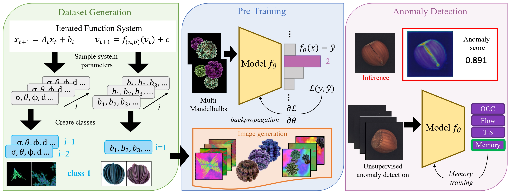

# Fractals as Pre-Training Datasets for Anomaly Detection and Localization

This is the official Python code implementation for:

<b>Fractals as Pre-Training Datasets for Anomaly Detection and Localization</b> <br/> 
Cynthia I. Ugwu, Emanuele Caruso, Sofia Casarin, Oswald Lanz<br/> 
[[Fractal Fract.]](https://www.mdpi.com/2504-3110/8/11/661) [[CVPRw]](https://openaccess.thecvf.com/content/CVPR2024W/TCV2024/html/Ugwu_Fractals_as_Pre-training_Datasets_for_Anomaly_Detection_and_Localization_CVPRW_2024_paper.html)<br/> 

The repository **fractal4AD** aims to leverage fractals, abstract geometric images generated through mathematical equations, 
to create synthetic large-scale datasets as an alternative to ImageNet. Similar to ImageNet, the pre-training objective is multi-class classification.
However, unlike traditional fractal research, which focuses on transfer learning to other classification datasets, this repository targets anomaly detection (AD), 
particularly feature-embedding-based methods. These methods require high-quality feature representations that can identify subtle visual variations since the 
pre-trained weights are directly applied to the target task without fine-tuning.

This framework enables the generation of diverse synthetic datasets by offering options to choose between two fractal types, add backgrounds, or use our 
innovative Multi-Formula methodology, which has demonstrated faster training convergence and improved performance compared to standard abstract datasets. 
These synthetic datasets can be used to train any model (we focused on ResNet-like architecture), whose learned 
weights are applicable across various AD methods. Fractal-based datasets provide significant benefits like: eliminate cost of data acquisition and labeling, 
avoiding privacy concerns, ethical issues, and unfair biases. This positions fractal-based datasets as a scalable and ethical alternative to widely used datasets like ImageNet, 
Instagram-3.5B, JFT-300M, or LAION-5B.



## Getting Started

The code uses [PyTorch](https://pytorch.org/) for training. Follow the [official PyTorch installation guide](https://pytorch.org/get-started/locally/) 
to install the version compatible with your system. Additional required packages are listed in `requirements.txt`.
```bash
# clone project
git clone https://github.com/cugwu/fractal4AD.git
   
# [RECOMMENDED] set up a virtual environment
python -m venv venv_name  # choose your prefered venv_name
source venv_name/bin/activate

# install requirements
pip install -r requirements.txt
```

## Dataset Generation
The directory `./src/fractals` contains code for generating large-scale datasets of fractal images. The implementation leverages `numba` 
for performance optimization, along with `numpy` and `opencv` for tasks such as colorspace conversion.
This code is built on top of the [fractal-pretraining](https://github.com/catalys1/fractal-pretraining/tree/main) repository.

### Fractals
You can generate a dataset of Iterated Function Systems (IFS), which serves as the basis for creating the final fractals dataset. 
The generated dataset will be saved as a `pickle` file. To create this dataset, run the `ifs.py` script:
```bash
# generate a dataset of 100,000 systems, each with between 2 and 4 affine transformations
python ifs.py --save_path ./ifs-100k.pkl --num_systems 100000 --min_n 2 --max_n 4
```
This will produce a `.pkl` file containing a dictionary with the following structure:
```python
{
  "params": [
    {"system": np.array(...)},
    ...
  ],
  "hparams": {
    ...
  }
}
```

The generated `.pkl` file can be used as an input parameter to generate the final fractals dataset. The following command 
generates a fractal dataset without a background, using the IFS dataset stored in `ifs-100k.pkl`. From this IFS database, 
50,000 IFS samples will be used to create a dataset with 1,000 classes, each containing 1,000 samples of size 512x512:

```bash
python dataset_generator.py --dataset_type fractals --param_file ./ifs-100k.pkl --dataset_dir ./fractals_dataset --num_systems 50000 --num_class 1000 --per_class 1000 --size 512
```

The dataset can also be generated directly without the `.pkl` file. In this case, the `ifs.py` script will be called internally by the `dataset_generator.py` script:
```bash
python dataset_generator.py --dataset_type fractals --dataset_dir ./fractals_dataset --num_systems 50000 --num_class 1000 --per_class 1000 --size 512
```

### Mandelbulbs 
The Mandelbulb is a three-dimensional extension of the Mandelbrot set, a well-known fractal defined in the complex plane. 
To generate this dataset, we utilized the generator provided in [MandelbulbVariationsGenerator](https://github.com/RistoranteRist/MandelbulbVariationsGenerator/tree/main?tab=readme-ov-file).
The generator was run using the provided Docker setup for easy environment configuration and execution:

```bash
# clone the repository
git clone https://github.com/RistoranteRist/MandelbulbVariationsGenerator.git
cd MandelbulbVariationsGenerator

# build the Docker image
docker build -t mandelbulb_variations_generator:0.0.1 .

# run the container
docker run -it --gpus all mandelbulb_variations_generator:0.0.1 mvg mandelbulbvariations --n_per_class 1000 --power_min 2 --power_max 18 --rules 107,106,263,334,205,271,434,225,331,413,141,167,424,196,222,461,488,109,151,232,42,188,507,32,451,132,190,481,143,96,180,388,397,68,135,197,360,40,465,243,506,160,327,175,105,223,198,332,452,174,281,395,238,386,161,168,204,416,244,418,297 --out out/mandelbulbvariations
```
### Multi-Formula 
To generate the dataset using our Multi-Formula strategy with Fractals as the source dataset, run the following command:
```bash
python dataset_generator.py --dataset_type multi-fractals --dataset_dir ./multifractals_dataset --num_systems 50000 --num_class 1000 --per_class 1000 --size 512
```

To generate the dataset using our Multi-Formula strategy with Mandelbulbs, we directly use the dataset generated by
[MandelbulbVariationsGenerator](https://github.com/RistoranteRist/MandelbulbVariationsGenerator/tree/main?tab=readme-ov-file)
as the source dataset (e.g., MandelbulbVAR-1k). In this case, the number of systems represents the number of classes in the source dataset. 
To generate the dataset, run the following command:
```bash
python dataset_generator.py --dataset_type multi-mandelbulbs --source_dir ./MandelbulbVAR-1k --dataset_dir ./multimandelbulbs_dataset --num_systems 1037 --num_class 200 --per_class 2000 --size 512
```

## Model pretraining
The directory `./src/training` contains code to train a ResNet-like architectures on the generated abstract datasets.
To train WideResNet-50 on 4 GPUs run the following command:
```bash
python main.py --data_path ./path_to_data --root_log ./logs --root_model ./checkpoints --store_name fractals --resnet_type wide_resnet50 --num_class 1000 --batch_size 1024 --epochs 100 --num_gpus 4
```
We provide WideResNet-50 models pre-trained on various dataset configurations as presented in Tables 13 and 14 of [[Fractal Fract.]](https://www.mdpi.com/2504-3110/8/11/661)
The reported accuracies refer to pixel-level and image-level AUROC scores achieved by the [PatchCore](https://github.com/amazon-science/patchcore-inspection) method on the MVTec AD dataset:

| Pre-Training Dataset              | Image AUROC | pixel AUROC | url                                                                                            |
|-----------------------------------|-------------|-------------|------------------------------------------------------------------------------------------------|
| MultiMandelbulbs (1000 cl.)       | 0.809       | 0.919       | [Google Drive](https://drive.google.com/drive/folders/1YMUvBeDkNhc41z4av7Bf1STZdfnoN_nn?hl=it) |
| MultiMandelbulbs-back (1000 cl.)  | 0.719       | 0.833       | [Google Drive](https://drive.google.com/drive/folders/1YMUvBeDkNhc41z4av7Bf1STZdfnoN_nn?hl=it) |
| MultiMandlebulbs (200 cl.) (VAR1) | 0.857       | 0.941       | [Google Drive](https://drive.google.com/drive/folders/1YMUvBeDkNhc41z4av7Bf1STZdfnoN_nn?hl=it) |
| MultiFractals (200 cl.)           | 0.771       | 0.900       | [Google Drive](https://drive.google.com/drive/folders/1YMUvBeDkNhc41z4av7Bf1STZdfnoN_nn?hl=it) |
| Fractals (200 cl.)                | 0.720       | 0.823       | [Google Drive](https://drive.google.com/drive/folders/1YMUvBeDkNhc41z4av7Bf1STZdfnoN_nn?hl=it) |


## Anomaly Detection with Anomalib

For the anomaly detection task, we used [Anomalib](https://github.com/openvinotoolkit/anomalib), a deep learning library 
designed to benchmark state-of-the-art anomaly detection algorithms on public and private datasets. The directory `./anomalib` 
contains essential files and code to integrate with the official Anomalib repository, enabling benchmarking of multiple anomaly detection 
methods on custom datasets. Subdirectories:
  - `./anomalib/mvtec`: Contains `config.yaml` files for configuring training on the MVTec AD dataset on six anomaly detection methods.
  - `./anomalib/visa`: Contains `config.yaml` files for configuring training on the ViSA dataset on six anomaly detection methods..

### Installation and Setup
To use Anomalib follow these steps:
1. **Clone the Anomalib Repository**  
   ```bash
   git clone https://github.com/openvinotoolkit/anomalib.git
   cd anomalib
   ```
2. **Install Anomalib**  
   Follow the official installation guidelines provided in the [Anomalib Installation Guide](https://github.com/openvinotoolkit/anomalib/tree/main).
3. **Add Custom Configurations**  
   Copy the directories `./anomalib/mvtec`, `./anomalib/visa`, and the script `benchmark.py` into the cloned Anomalib repository.
4. **Run Benchmarking**  
   Use the `benchmark.py` script to evaluate different anomaly detection methods on the dataset of interest. For example:
   ```bash
   python benchmark.py --yaml_config fastflow_config.yaml patchcore_config.yaml rd_config.yaml --dataset mvtec --pretrained --results_dir ./output_path
   ```
### Important Notes
**Pretraining with Custom Weights:** The `--pretrained` flag in Anomalib defaults to using pre-trained weights from ImageNet. 
To use custom pre-trained weights, you will need to modify the Anomalib scripts to correctly load the desired weights.

## License
This project is distributed under the Apache License, Version 2.0. See `LICENSE.txt` for more details.
Some parts of the code are licensed under the MIT License. For those cases, the MIT License text is included at the top 
of the respective files.

## Citation

If you use this code or find our work helpful for your resarch, please cite the following papers:
```bibtex
@Article{fractalfract8110661,
AUTHOR = {Ugwu, Cynthia I. and Caruso, Emanuele and Lanz, Oswald},
TITLE = {Fractals as Pre-Training Datasets for Anomaly Detection and Localization},
JOURNAL = {Fractal and Fractional},
VOLUME = {8},
YEAR = {2024},
NUMBER = {11},
ARTICLE-NUMBER = {661},
URL = {https://www.mdpi.com/2504-3110/8/11/661},
ISSN = {2504-3110},
DOI = {10.3390/fractalfract8110661}
}

@InProceedings{Ugwu_2024_CVPR,
    author    = {Ugwu, Cynthia I. and Casarin, Sofia and Lanz, Oswald},
    title     = {Fractals as Pre-training Datasets for Anomaly Detection and Localization},
    booktitle = {Proceedings of the IEEE/CVF Conference on Computer Vision and Pattern Recognition (CVPR) Workshops},
    month     = {June},
    year      = {2024},
    pages     = {163-172}
}
```